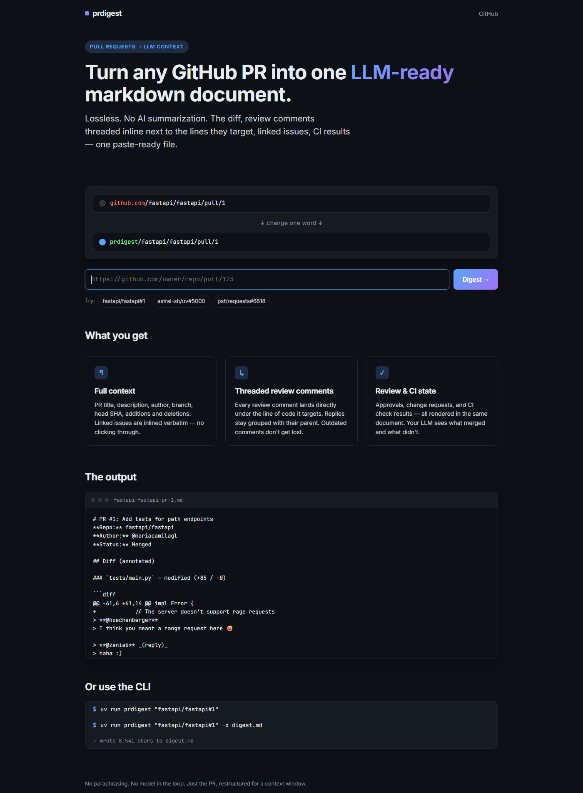

# prdigest

Render any GitHub pull request as a single, LLM-ready markdown document.

Replace `github.com` with your prdigest host on a PR URL to collect the PR description, linked issues, diff patches, inline review comments, review state, and CI results. The output contains source material for review; it does not generate an AI summary.



## Install

```pwsh
uv sync --extra dev
```

## Use

**CLI:**

```pwsh
uv run prdigest octocat/Hello-World#1
uv run prdigest https://github.com/octocat/Hello-World/pull/1 -o digest.md
```

**Web app:**

```pwsh
uv run uvicorn prdigest.web.app:app --reload
```

Then visit `http://localhost:8000/octocat/Hello-World/pull/1`.

**Library:**

```python
import asyncio
from prdigest import build_digest

md = asyncio.run(build_digest("octocat/Hello-World#1"))
```

## Auth

Set `GITHUB_TOKEN` before running the CLI, web app, or library. The client uses
GitHub's GraphQL API for PR metadata, so authentication is required for public
repositories as well as private ones.

If you already use the GitHub CLI, reuse its active login in the current
PowerShell session:

```pwsh
$env:GITHUB_TOKEN = gh auth token
```

For another environment, provide a token through its environment-variable or
secret-management mechanism. Private repositories must be accessible to that
token. Keep tokens out of source files and generated digests.

## Current limits

This version fetches up to 100 review threads, 50 comments per thread, 100
conversation comments, 50 reviews, 20 linked issues, and 50 checks. File patches
are paginated up to GitHub's 3,000-file limit; binary or oversized changes may
not include a patch. Use GitHub itself when a complete audit of a large PR is
required.

## Layout

- `src/prdigest/core.py` — `build_digest()` entry point
- `src/prdigest/github.py` — GraphQL + REST client
- `src/prdigest/diff.py` — patch parser + review-comment inliner
- `src/prdigest/render.py` — markdown assembly
- `src/prdigest/cli.py` — Typer CLI
- `src/prdigest/web/` — FastAPI app + Jinja templates

## Tests

```pwsh
uv run pytest -q
```
